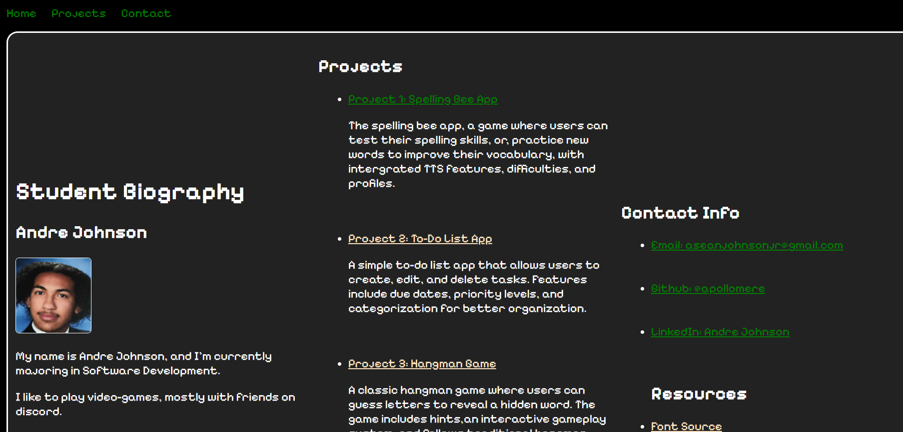

My Biography: Improved Layout Edition

-This is a website I made, in order to inform people of my work, passions, and past project experiences. Here, you can not only learn a little more about me, but also the work I enjoy doing!

-All in one place; The idea is to have everything in one place, here, you can find everything you need to contact me, or know more about me, as being restricted to just one platform doesn't show everything I have to offer!

-Here, you'll see my process of learning HTML practices; CSS, JavaScript, and more. You'll see this places history of transformation as I slowly imrpove my principle and website designing skills.

Table of Contents:
-Installation

-Usage

-Testing

//Installation//
To install; ensure you have a compatible web browser API; Chrome, Opera, Firefox, etc.
1. Install the .css, .html, and any .js files necessary.
2. Drag and drop them into a folder of your choosing.
3. Ensure that any img pathways in the HTML is set to the pathway of your created folder.
4. Run the HTML file through a browser of your choosing.

//Usage//
This is a website for you to explore and interact with, includes links to external sites, navigation menus, and information about me.
More intergrated menus are planned to be implemented in the future.

//Testing//
-Had to make new div sections for the columns functions, tested various width options, tried to just use their class dividers, but, made each of them unequal.
-Had problems with integrating flex box with the column divider, figured out it was because @media access specification kept on overriding the default .flex-container style.
//Having trouble centering navigation bar, may need to find another solution, as text-align does not seems to truly center it.

